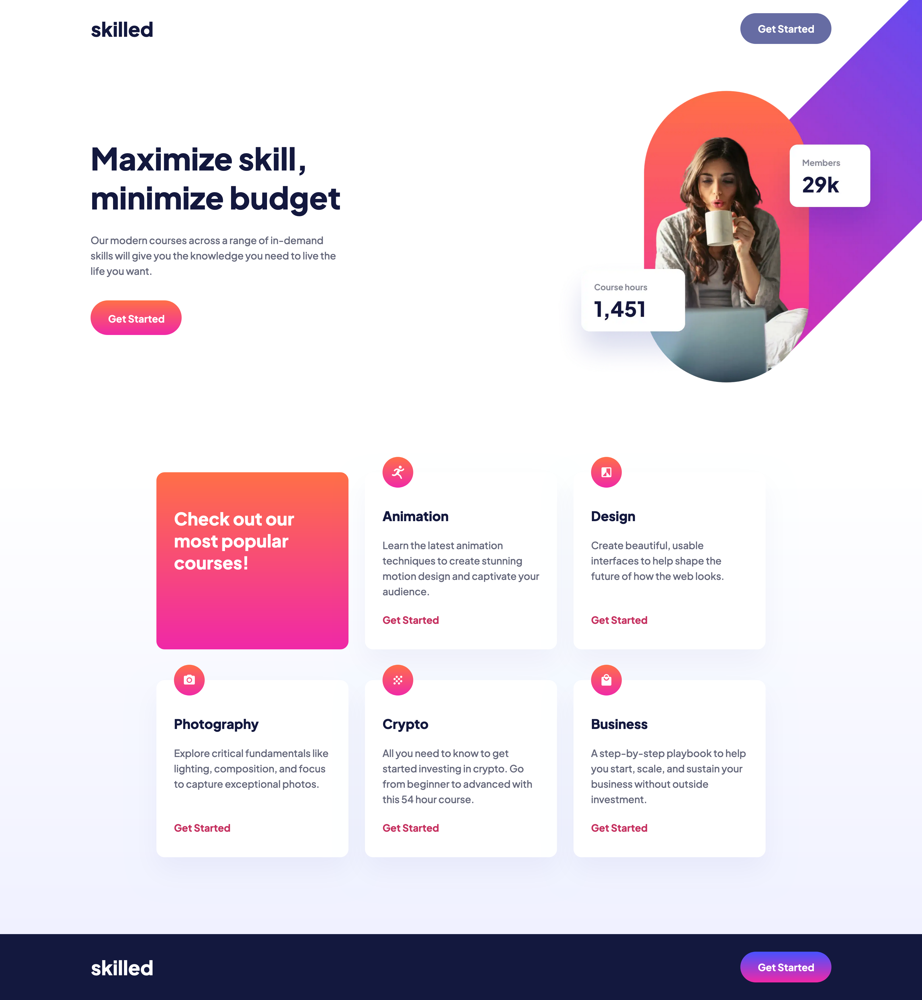
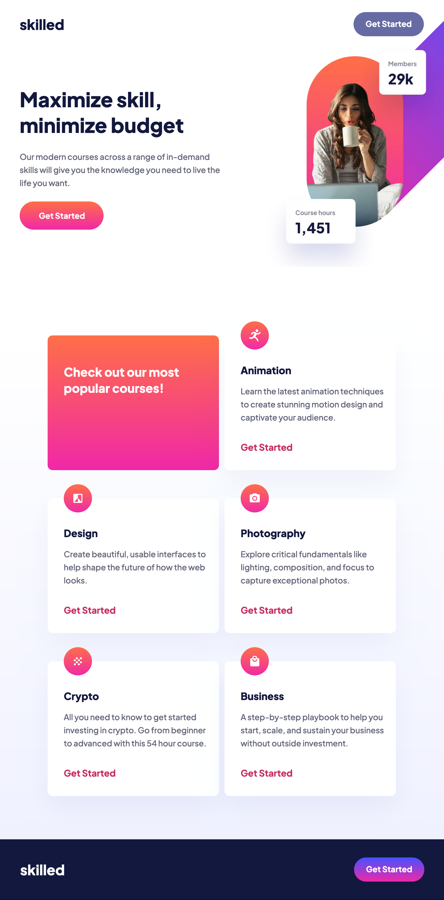
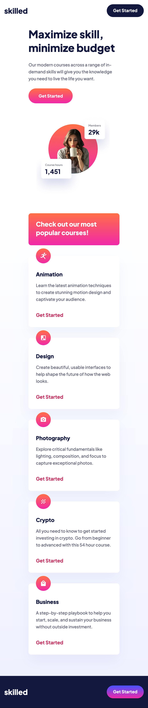

# Frontend Mentor - Skilled e-learning landing page solution

This is a solution to the [Skilled e-learning landing page challenge on Frontend Mentor](https://www.frontendmentor.io/challenges/skilled-elearning-landing-page-S1ObDrZ8q). Frontend Mentor challenges help you improve your coding skills by building realistic projects.

## Table of contents

- [The challenge](#the-challenge)
- [Screenshots](#screenshots)
  - [1. Desktop version](#1-desktop-version)
  - [2. Tablet version](#2-tablet-version)
  - [3. Mobile version](#3-mobile-version)
- [PageSpeed Insights results](#pagespeed-insights-results)
- [Links](#links)
- [My process](#my-process)
  - [Built with](#built-with)
  - [Tested with](#tested-with)
  - [What I learned](#what-i-learned)
  - [Useful resources](#useful-resources)
- [Author](#author)
- [Acknowledgments](#acknowledgments)

## Overview

### The challenge

Users should be able to:

- View the optimal layout depending on their device's screen size
- See hover states for interactive elements

### Screenshots

##### 1. Desktop version

##### 2. Tablet version

##### 3. Mobile version

### PageSpeed Insights results

[Mobile version](https://pagespeed.web.dev/analysis/https-skilled-elearning-landing-page-rc-netlify-app/8ozpof9vqw?form_factor=mobile)

[Desktop version](https://pagespeed.web.dev/analysis/https-skilled-elearning-landing-page-rc-netlify-app/8ozpof9vqw?form_factor=desktop)

### Links

- Solution URL: [Skilled elearning landing page github](https://github.com/rupali317/skilled-elearning-landing-page)
- Live Site URL: [Skilled elearning landing page live](https://skilled-elearning-landing-page-rc.netlify.app/)

## My process

### Built with

- Semantic HTML5 markup
- CSS custom properties
- Flexbox
- CSS Grid
- Mobile-first workflow
- [React](https://reactjs.org/) - JS library
- [Styled Components](https://styled-components.com/) - For styles
- [Netlify](https://www.netlify.com/) - A cloud platform that provides hosting services

### Tested with

- Browsers used for testing: Google Chrome, Firefox, Safari, Brave, Microsoft Edge.
- Devices:
  - (Real) MacBook Pro (15-inch), Samsung Galaxy A33 5G, Samsung Galaxy S20+, iPad Air 2, MacBook Pro (13-inch).
  - (Virtual) The mobile and tablet devices mentioned under Chrome's dev console.
- Screen reader: MacOS VoiceOver.

### What I learned

1. This challenge provided image files in both formats: webp and png. png supports only loseless compression, which implies that the file size does not reduce as effectively as webp. webp supports both lossy and loseless. Loseless compression is desired since the image quality is not compromised when the file size is reduced. png is supported in all browsers. webp is supported by most modern browsers (Chrome, Firefox, Edge, Opera, and Safari) but may not work for older versions. Weighing the pros and cons, I ultimately selected webp since I am placing importance to the load time and image quality. The only disadvantage is that there can be users who use very old version of the browsers and webp will not be supported there.

2. These are the following ways of displaying the images and I grasped which method will be ideal for certain scenarios:

- `<picture>` element. Only the image needed for our screen size gets downloaded. It eliminates the need to write extra CSS code of showing/hiding images based on form factors. Great for performance. However, if images need to be chopped off from the viewport, then overflow will happen since we will use positioning and right/left properties. The right/left or even translateX() will cause the overflow.
- `background-image:url(..)` and showing images based on form factors. If some images are chopped off from the veiwport, then using background-image and background-position will be ideal since it does not cause overflow.

### Useful resources

- [Can i use](https://caniuse.com/webp) - "Can I use" provides up-to-date browser support tables for support of front-end web technologies on desktop and mobile web browsers. It helped me to verify the versions of the browsers that support png and webp.

## Author

- Website - [Rupali Roy Choudhury](https://www.linkedin.com/in/rupali-rc/)
- Frontend Mentor - [@rupali317](https://www.frontendmentor.io/profile/rupali317)

## Acknowledgments

- I express my gratitude towards my mentor - Deborah for the insightful code review session.
